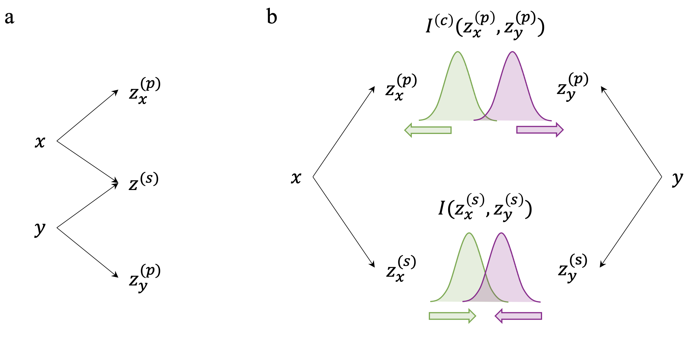

# DVIB: Disentangled Variational Information Bottleneck for Multiview Representation Learning

DVIB is an information bottleneck method that tries to disentangle multiview data into shared and private representations.
The implementation is based on the implementation from Multi-view information bottleneck (MIB, Marco Federici, et al, 2020). DVIB used the same wrap function as MIB demonstration. Please refer to https://github.com/mfederici/Multi-View-Information-Bottleneck to run the code. 

## Overview
Multiview data combine information from multiple modalities and have potentials to provide more comprehensive features for diverse machine learning tasks. A fundamental question in multiview learning is how additional views provide effective information compared with single view and is it possible to quantitatively identify this addtional information. 

In this work, we try to tackle this challenge by decomposing the entangled multiview features into shared latent representations that are common across all views and private representations that are specific to each single view.
We formulate this feature disentabglement in the framework of information bottleneck and propose disentangled variational information bottleneck (DVIB). DVIB explicitly  defines the properties of shared and private representations using constrains from mutual information. By deriving variational upper and lower bounds of mutual information terms, representations are efficiently optimized. 

**Fig. 1 | An overview of the study.** (**a**) Single-cell spatial transcriptomics technologies provide cell infromation from both transcriptional and morphological modalities, which reveal cell heterogeneity from different angles. (**b**) Cell differences in the tissue can be characterized based on each single modalties. (**c**) By combining both heterogeneities from two modalities, fine-grained cell subpopulations can be revealed.

## DVIB implementation

DVIB implemented based on multi-view information bottleneck https://github.com/mfederici/Multi-View-Information-Bottleneck. We appreciate the authors in releasing the code. 

DVIB was tested with the following packages:

- Python >= 3.6
- Pytorch >= 1.18.0
- Numpy >= 1.16.2
- Scipy >= 1.1.1

## Copyright
Software provided as is under **MIT License**.

Permission is hereby granted, free of charge, to any person obtaining a copy of this software and associated documentation files (the "Software"), to deal in the Software without restriction, including without limitation the rights to use, copy, modify, merge, publish, distribute, sublicense, and/or sell copies of the Software, and to permit persons to whom the Software is furnished to do so, subject to the following conditions:

The above copyright notice and this permission notice shall be included in all copies or substantial portions of the Software.

THE SOFTWARE IS PROVIDED "AS IS", WITHOUT WARRANTY OF ANY KIND, EXPRESS OR IMPLIED, INCLUDING BUT NOT LIMITED TO THE WARRANTIES OF MERCHANTABILITY, FITNESS FOR A PARTICULAR PURPOSE AND NONINFRINGEMENT. IN NO EVENT SHALL THE AUTHORS OR COPYRIGHT HOLDERS BE LIABLE FOR ANY CLAIM, DAMAGES OR OTHER LIABILITY, WHETHER IN AN ACTION OF CONTRACT, TORT OR OTHERWISE, ARISING FROM, OUT OF OR IN CONNECTION WITH THE SOFTWARE OR THE USE OR OTHER DEALINGS IN THE SOFTWARE.

